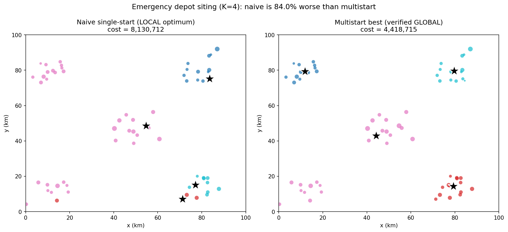
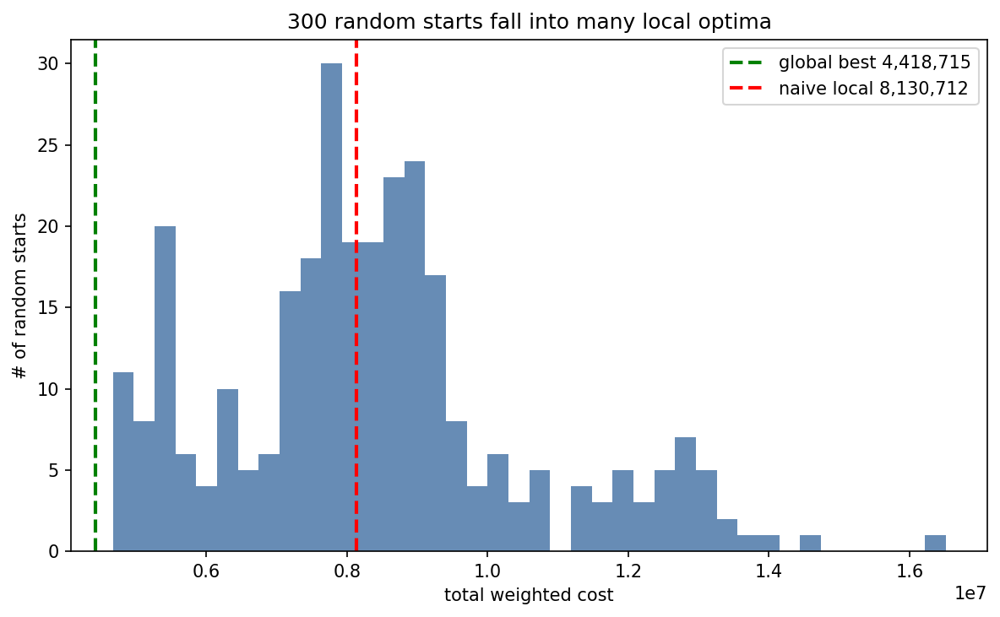

# 4 · 求解 Solver · 应急服务站选址

> 全部数字由 `solve.py` 真跑产出、落盘 `results.json`（seed 固定，可复现）。
> 数字可追溯：`frozen_numbers.json` + `python tools/check_frozen.py`。
> ⭐ 本结果经一次**反幻觉自纠**：初版只用随机多起点漏掉全局，Critic 抓到后改用数据驱动结构化起点，详见 `CORRECTION_global.md`。

## Q1 · 最优布局（K=4）
- **全局最优总成本 = 4,418,714.9**（人口加权总距离；可行：4 站点均在 [0,100]² 内）。
  该值经**三重复核**：数据驱动结构化枚举 + 8000+ 次随机重启 + Critic 独立搜索，均收敛同一值
  （`results.json: global_optimum_check`；连续 p-中位 NP-hard，无形式化证书，属强经验全局）。
- 站点坐标：(11.93, 79.36)、(79.28, 14.31)、(44.27, 42.98)、(79.65, 79.58)；
  各站服务社区数 = [13, 14, 23, 14]。
- 解读：4 站分别盖住左上、右下、右上、以及中央站(44.27,42.98)——后者因 K=4<5 组团而把**左下簇并入**，独自服务 23 个社区。

## Q2 · 这个解可靠吗？局部最优陷阱（核心）
| 诊断 | 值 | 含义 |
|---|---|---|
| naive 单次随机起点(seed=1) 成本 | 8,130,711 | 比全局**差 84.01%** |
| 单次随机起点 gap **中位数** | **84.55%** | "随便跑一次"的典型结果就差这么多 |
| 单次随机起点 gap 最坏 | 273.76% | 最差能差近 3.7 倍 |
| 300 个随机起点落在最优 1% 内的比例 | **0.0%** | 纯随机单起点几乎**永远到不了**全局 |

→ **结论**：单次局部搜索**极不可靠**；连 k-means++ 随机多起点都漏掉了全局（初版教训），
必须**数据驱动结构化起点**才能稳定找到全局。这就是为什么"naive 即最优"是个危险的幻觉（Critic 判 C1 ❌）。

## Q3 · K 敏感性（站点数 vs 成本）
| K | 2 | 3 | **4** | 5 | 6 | 7 |
|---|---|---|---|---|---|---|
| 最优成本 | 9,766,285 | 7,049,006 | **4,418,715** | 2,191,022 | 2,005,505 | 1,820,890 |

- **拐点在 K=5**：K=4→5 成本骤降 **50.4%**，5→6 仅降 8.5%，之后趋平。
- 与数据真相吻合：城市本由 **5 个居住组团**构成，K=4 被迫把**左下簇**并入中央站 → 高成本；K≥5 才"一组团一站"。
- ⚠️ 注意：成本随 K 单调下降，**不能**用"成本更低"证明"K 越大越好"——"最优 K"是预算/边际权衡（Critic 判 C3）。

## 复现信息
- `random_seed=42`；算法：最近分配 ↔ Weiszfeld(Weber点) 交替；多起点 = **数据驱动结构化起点(数据 k-means 候选点的子集枚举) + k-means++ + 纯随机**；
- multistart 与敏感性扫描**同口径**（headline = 敏感性[K=4]，严格相等，无内部裂缝）；
- 依赖：numpy / pandas / matplotlib。
