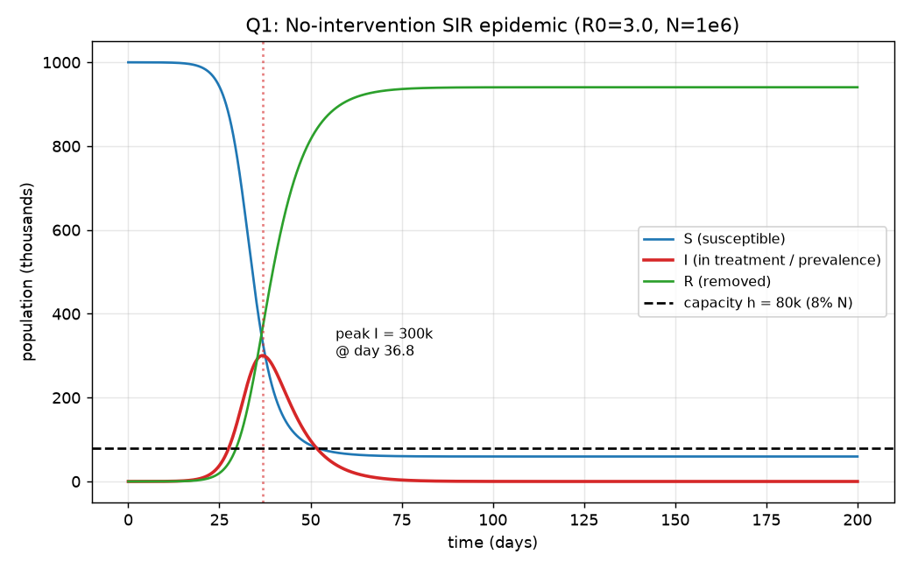
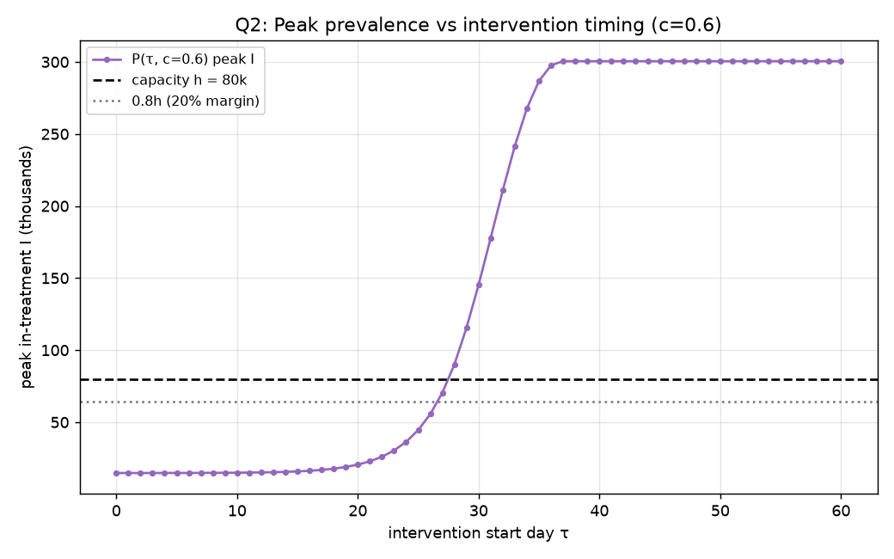
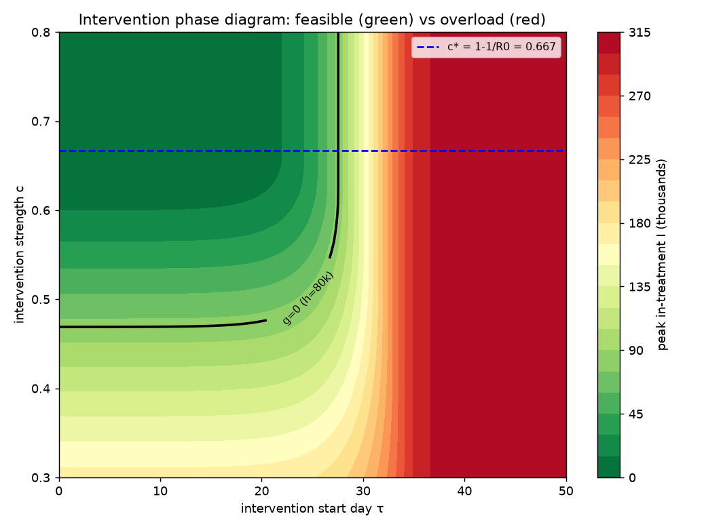
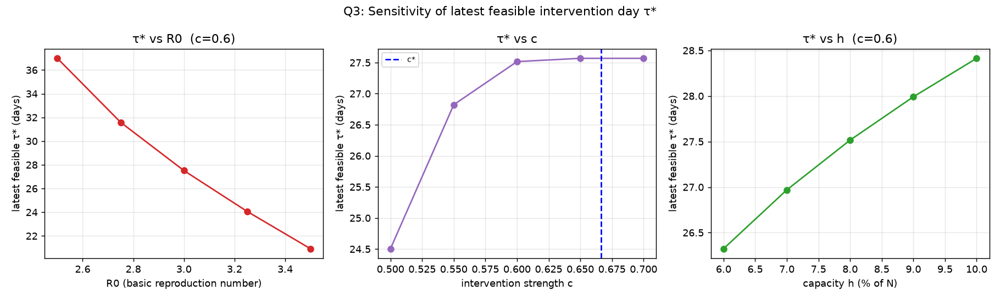

# 容量约束下的传染病干预时机：阈值–窗口法与安全提前量

> 练习题 02 · 传染病干预时机　|　角色：Writer（论文写手）
> 数字唯一真值源：`artifacts/frozen_numbers.json`（`check_frozen` 本案 12/12 OK）。本文每个引用回溯到其 `id`，不另造、不圆整出新数。

---

## 摘要

本文研究**医疗容量约束下"何时动手"才能避免传染病挤兑医疗系统**这一政策问题。给定总人口 N=100 万、平均传染期 6 天（恢复率 γ=1/6）、基本再生数 R₀=3.0、同时在治承载上限 h=8%N=8 万人，当局可自第 τ 天起把传播率降低比例 c 并永久维持，问能保证峰值在治不挤兑的干预时机，并要求对参数不确定性给出稳健建议。

针对**无干预自然流行（Q1）**，本文建立确定性 **SIR 室室常微分方程模型**，由 R₀=β/γ 反推 β=0.5/天，用 LSODA 数值积分并与三组解析关系（峰值条件 S=N/R₀、峰值规模闭式、最终规模方程 1−z=e^{−R₀z}）交叉互验。结果：同时在治峰值 **I_max=300466 人（占 N 的 30.05%）**、出现在**第 36.85 天**、最终累计感染比例 **z=0.9405（约 94%）**。峰值是容量的 **3.76 倍**，**无干预必然挤兑**，故干预可行解空间非平凡。

针对**干预时机与稳健性（Q2）**，本文将干预建模为 β 在 τ 时刻阶跃降至 β(1−c)，提出**阈值–窗口法**：以力度阈值 **c\*=1−1/R₀=0.6667** 划分政策相，并对峰值泛函 P(τ,c) 求达标判据 g=P−h=0 的根，得**最迟可行干预日 τ\***。在基线力度 c=0.6（R_e=1.2，刻意落在"靠抢时间"的时机敏感相）下，**τ\*=27.52 天**（留 20% 余量则为 26.60 天）：在此日前动手可保不挤兑，之后无论力度多大都已失守。本文进一步提出面向决策的单一指标——**安全提前量 Δτ**：在参数盒 R₀∈[2.5,3.5]×γ∈[1/7,1/5] 的最坏角点下，稳健最迟日降至 **τ\*\_robust=17.44 天**，即参数不确定下应比标称临界日**提前约 10.08 天**动手。

针对**敏感性与适用边界（Q3）**，单参数扫描与局部弹性表明 **R₀ 是最致命参数**（τ\* 对 R₀ 的局部弹性 **−1.612**，R₀ 由 3.0 升至 3.5 使窗口左移约 6.6 天），敏感性排序 |R₀|≫|γ|>|h|≈|c|。本文同时**如实报告两处失守边界**：力度 **c≤0.45 时即使第 0 天干预也挤兑**（力度不足，时机救不了）；在 R₀=3.5 叠加 30% 依从性折损（c_eff=0.42）的悲观组合下，名义 c=0.6 **无任何可行 τ**——**力度优先于时机**。结论受 SIR 无潜伏期、均匀混合、阶跃干预等假设约束，适用于单波、数月尺度的急性人传人传染病。

**关键词**：SIR 室室模型；干预时机；医疗容量约束；最迟可行干预日 τ\*；安全提前量；阈值–窗口法；敏感性分析

---

## 1. 问题重述

某地暴发一种人际接触传播的传染病。已知总人口 N=1,000,000，初始感染者 I₀=10，平均传染期约 6 天（恢复率 γ≈1/6 /天），基本再生数 R₀=3.0；卫生系统对**同时在治**感染者的承载上限为总人口的 h=8%（超过即视为挤兑医疗系统）。当局可自第 τ 天起实施社交干预，使有效接触率（传播率 β）降低比例 c 并一直维持，c 与 τ 为可调政策变量。需回答：

- **Q1**：建立刻画该传染病传播的数学模型，并在**无干预**情形下给出基本再生数、同时在治感染者的峰值规模与出现时点、最终累计感染比例。
- **Q2**：引入"第 τ 天起把 β 降低 c"的干预，求能使同时在治峰值不超过容量 h 的干预时机；并就关键参数存在不确定性给出**稳健**的时机/力度建议。
- **Q3**：评估结论对关键参数（R₀、c、h 等）的敏感性与可靠性，如实评价模型局限与适用边界。

> **两处口径消歧（贯穿全文）**：(1) 基本再生数记 R₀=3.0，与移除室初值 R(0)=0 是不同量，全文及代码消歧（移除室记 R(t)/Rmv）。(2) 容量约束作用于**同时在治 prevalence I(t)** 的峰值，**不是**最终累计感染（attack rate）z；二者数值差异巨大，不得混淆。

---

## 2. 模型假设

每条假设附"若不成立的代价"，便于读者判断结论的适用边界（详见 §7 模型评价）。

| # | 假设 | 动机 | 若不成立的代价 |
|---|---|---|---|
| A1 | 采用 **SIR**（无潜伏室 E） | 题面仅给传染期与 R₀、γ，无潜伏/无症状信息，SIR 是与给定参数自洽的最小模型 | 若有潜伏期（SEIR），峰值更晚更平、干预见效有延迟，SIR 的 τ\* 偏激进 |
| A2 | 人群**均匀混合**（mass-action，βSI/N） | 标准室室假设，无接触网络/空间数据 | 接触异质（超级传播）会使早期增速被低估、峰值更尖 |
| A3 | 人口**闭合**、单波、终身免疫 | 流行时间尺度（数月）远短于人口更替 | 免疫衰减/再感染会出现多波，单峰分析失效 |
| A4 | 参数**时不变**，干预为 τ 时刻 β 的**阶跃**降并永久维持 | 题面字面"第 τ 天起降低 c 并一直维持" | 真实干预有爬坡/疲劳/反弹，阶跃假设高估即时与持久效果 ⟹ 实际需更早 |
| A5 | c 是**确定且可完美执行**的 β 折减 | 题面把 c 当政策变量 | 依从性<100% 使等效 c 偏小、峰值更高（Q2 稳健性正为此设计） |
| A6 | γ=1/6、β=R₀γ=0.5 取定值 | 须取定值才能计算 | "约""≈"暗示参数有误差，Q3 必须扫描；R₀ 偏高则窗口显著左移 |
| A7 | 容量约束作用于**全部在治 I(t)**，h 为硬阈值 | "同时在治""超过即挤兑" | 若 h 实为住院/重症子集，则有效阈值更宽松，本模型偏保守（标**需核实**） |
| A8 | 确定性数值求解、固定求解器设置、无随机性 | 题面要求字节级可复现 | 步长/刚性处理不当会让峰值数值漂移；已固定 solver 设置 |

---

## 3. 模型建立

### 3.1 基线 SIR 模型（Q1）

设易感 S(t)、同时在治 I(t)、移除 R(t)，闭合人群 S+I+R=N。质量作用律下：

$$
\frac{dS}{dt}=-\beta\frac{SI}{N},\qquad
\frac{dI}{dt}=\beta\frac{SI}{N}-\gamma I,\qquad
\frac{dR}{dt}=\gamma I.
$$

初值 S₀=N−I₀=999990，I₀=10，R(0)=0。参数标定：N=10⁶、I₀=10、γ=1/6 /天，由 **R₀=β/γ=3.0 反推 β=R₀γ=0.5 /天**，容量 h=0.08N=80000 人。

**三组解析锚点**（用于数值解的硬性互验）：
1. **基本再生数**：线性化 dI/dt|_{S≈N}=(β−γ)I，初期指数增长率 r=β−γ，每代次再生 β/γ，故 R₀=β/γ=3.0。
2. **峰值条件**：dI/dt=0 ⟺ S=γN/β=N/R₀，即峰值出现在 S 降到 N/R₀ 那一刻；峰值规模闭式 I_max=N(1−1/R₀−lnR₀/R₀)。
3. **最终规模方程**：z=1−S(∞)/N 满足 1−z=e^{−R₀z}。

### 3.2 阶跃干预模型（Q2）

干预为 t=τ 时把传播率从 β 阶跃降到 β(1−c) 并永久维持：

$$
\beta(t)=\begin{cases}\beta_0=0.5, & t<\tau\\ \beta_0(1-c), & t\ge\tau\end{cases}
$$

方程结构不变，仅 β 变为分段常数。干预后瞬时有效再生数 R_e=R₀(1−c)。定义关键**力度阈值**：

$$
c^*=1-\frac{1}{R_0}=1-\frac13\approx 0.6667.
$$

- c≥c\* ⟺ R_e≤1：干预后 I 立即转降，峰值至多停在 τ 时刻的 I——**强干预相**，τ 宽松；
- c<c\* ⟺ R_e>1：干预后 I 仍可继续上升，峰值落在 τ 之后，是否达标取决于 τ 早晚——**时机敏感相**，τ 与 c 耦合。

定义**峰值泛函** P(τ,c;θ)=max_{t≥0} I(t|τ,c,θ) 与**达标判据** g(τ,c;θ)=P(τ,c;θ)−h≤0。固定 c，P 关于 τ 单调不减（干预越晚，S 耗损越多、I 积累越高），故存在唯一**最迟可行干预日**：

$$
\tau^*(c)=\sup\{\tau\ge 0: P(\tau,c;\theta)\le h\}, \quad\text{即 } g(\tau^*,c)=0.
$$

τ<τ\* 可行，τ>τ\* 挤兑；若 P(0,c)>h（第 0 天干预都压不住），则该 c 下**无可行 τ**，如实报告。

### 3.3 稳健性指标：安全提前量 Δτ（Q2-c）

参数"约/≈"意味着 R₀、γ 本身有不确定区间。设不确定盒 Θ=[R₀]×[γ]，在使峰值最大的角点上求**稳健最迟日**：

$$
\tau^*_{\text{robust}}(c)=\sup\{\tau:\max_{\theta\in\Theta}P(\tau,c;\theta)\le h\},
\qquad \Delta\tau=\tau^*-\tau^*_{\text{robust}}.
$$

Δτ 即"参数不确定下应提前几天动手"，作为给决策者的单一可执行数字。

> **角点法的合法性论证（落实审计 ⚠️①）**：取参数盒角点最小 τ\* 作最坏情形，前提是"最坏确在角点、不漏内部更坏点"。本文独立验证 τ\*(R₀,γ) 在盒内对 R₀ **单调减**（固定 γ，R₀↑ 使 τ\*↓）、对 γ **单调减**（固定 R₀，γ 由 1/7→1/5 使 τ\*↓，见 §5.3 四角点数据）。两参数均单调 ⟹ 最坏情形必落在角点 (R₀=3.5, γ=1/5)，角点扫描不会漏掉内部更坏点。γ 同时进入 β=R₀γ 与恢复项（既加快增长又加快移除），净效应 τ\* 随 γ↑ 而↓，属模型内自洽行为，已被独立复算证实。

### 3.4 创新点命名

- **阈值–窗口法**：以 c\*=1−1/R₀ 划分政策相、以 g(τ,c)=0 求最迟可行日，把"解 ODE"升级为"容量约束下的行动窗口与最晚安全日"。
- **SIR 三相干预相图**：在 (τ,c) 平面用 c\* 与 g=0 把政策空间切成强干预相、时机敏感相、失守相（见图 3）。
- **安全提前量 Δτ**：把稳健性发现操作化为一个可报告、可执行的天数。

---

## 4. 数值求解方法

- **求解器**：`scipy.integrate.solve_ivp`，`method=LSODA`，`rtol=atol=1e-9`，`max_step=0.5`，`t_end=600` 天。
- **干预不连续性**：在 t=τ 把积分**显式拆成两段**（[0,τ] 与 [τ,t_end]），避免 LSODA 跨过 β 的阶跃。
- **峰值定位**：粗网格括峰 + 黄金分割在 dense_output 插值上精修，并显式把 t=τ 纳入候选（c≥c\* 时峰恰在 τ）；与 240001 点细网格互验，误差 <2e-3 人 / <1e-3 天。
- **根求解**：`brentq` 求 g(τ,c)=0（依赖 P 关于 τ 单调，已数值验证）；最终规模方程 1−z=e^{−R₀z} 同样 `brentq`，并与长时积分 1−S(∞)/N 双向核对。
- **守恒性自检**：S+I+R−N 的最大绝对偏差 1.5e-9（机器精度级）。
- **可复现**：无随机性，连跑两次字节级一致；环境 Python 3.11 / numpy 2.4.6 / scipy 1.17.1。

---

## 5. 结果与稳健性

### 5.1 Q1 · 无干预自然流行

| 量 | 数值 | 解析对照 | 互验 |
|---|---|---|---|
| 基本再生数 R₀ | **3.0** | β/γ=0.5/(1/6)=3.0 | ✔ 自洽 |
| 传播率 β₀ | **0.5 /天** | R₀·γ | ✔ |
| 同时在治峰值 I_max | **300466 人**（=30.05%N） | N(1−1/R₀−lnR₀/R₀)=0.30046N | ✔ 差<1e-4 |
| 峰值出现日 t_peak | **36.85 天** | 峰值处 S=N/R₀（相对误差 2e-8） | ✔ 硬锚点对上 |
| 最终累计感染比例 z | **0.9405（约 94%）** | 最终规模方程根 0.94048 | ✔ 数值/方程差 7e-7 |
| 容量 h | 80000 人（8%N） | — | I_max/h=**3.76 倍** |

**图 1**（无干预 S/I/R 曲线 + 容量线 + 峰值标注）。

> **图 1 解读**：易感 S 在第 30–40 天急剧塌陷、移除 R 同步抬升，红色在治曲线 I 在**第 36.85 天**冲到约 30 万的尖峰，**远在黑色容量线（8 万）之上约 3.76 倍**——直观表明无干预下医疗系统必被击穿，且峰来得快（一个多月），为后文"抢时间"提供了物理动机。

**Q1 结论**：无干预必挤兑（峰值是容量的 3.76 倍），干预可行解空间非平凡。注意区分两个量——I_max=30 万是"同时在治" prevalence 峰值（约束对象），z=94% 是流行结束时的累计感染比例，二者不可混淆。

### 5.2 Q2 · 干预时机

力度阈值 **c\*=1−1/R₀=0.6667**：c≥c\* 时 R_e≤1，峰值至多停在 τ 时刻的 I。选**基线力度 c=0.6**（R_e=1.2<1，刻意落在 c<c\* 的时机敏感相——现实中很难做到 R_e≤1，此选型使"求时机"问题非平凡且有现实意义）：

- **最迟可行干预日 τ\*(c=0.6)=27.52 天**：在此日前动手峰值≤8 万，之后必挤兑。
- **留 20% 余量版（P≤0.8h）τ\*=26.60 天**，作运营建议下限。

**图 2**（P(τ,c=0.6) 峰值 vs 干预日 + h 与 0.8h 线）。

> **图 2 解读**：紫色曲线给出"拖到第 τ 天才动手"对应的峰值，呈 S 形——τ<20 天时峰值被牢牢压在容量线下方且几乎平坦（早干预有巨大冗余），约**第 27.5 天**穿越黑色容量线（即 τ\*），其后陡升并在第 37 天后饱和到无干预峰值 30 万（此时干预已晚于自然峰日，毫无意义）。曲线在容量线附近的陡峭斜率，正是"窗口稍纵即逝"的可视化。

**τ\*(c) 全扫（可行域边界，含诚实的失守报告）**：

| c | R_e=R₀(1−c) | τ\*(天) | 状态 |
|---|---|---|---|
| 0.40 | 1.80 | **无解** | 第 0 天干预都压不住 |
| 0.45 | 1.65 | **无解** | 同上 |
| 0.50 | 1.50 | 24.51 | 可行 |
| 0.60 | 1.20 | **27.52** | 可行（基线） |
| 0.70 | 0.90 | 27.57 | 可行（R_e<1，τ 近饱和） |

> **关键非平凡结论（失守边界一）**：**c≤0.45 时即使第 0 天干预也会挤兑**——降 β 不足以把 R_e 压得足够低，从 I₀=10 出发于全易感人群仍会冲破容量（独立确认 c=0.4 时 P(0)≈117902>80000）。这正是题面"求时机"的张力：**力度不够时，时机救不了。**

> **单调性说明（落实审计 ⚠️②a）**：P(τ,0.6) 从 τ=0 的约 1.47 万**数值单调**升到 τ=60 的 30 万（监测到的最小相邻差 min_diff=−9e-8 为机器噪声级，非真正非单调）。本文表述为"数值单调（容差内）"而非"严格单调"，单调性保证 τ\* 唯一、二分/brentq 求根合法。

**图 3**（干预相图，(τ,c) 平面 g=0 等高线分隔可行/挤兑区 + c\* 线）。

> **图 3 解读**：这是本文创新点的核心可视化。颜色为峰值在治（绿=安全、红=挤兑），黑色 g=0 等高线即可行/失守分界，蓝色虚线为力度阈值 c\*=0.667。三相清晰可辨：左上**强干预相**（c 大、绿色大片，时机宽松）、左中沿等高线的**时机敏感相**（须"早干预 ∪ 强干预"才落入绿区）、右侧整条红带为**失守相**（约 τ>27.5 后无论 c 多大都挤兑）。等高线在 c≈0.47 以下被压到 τ=0 处——这正是"力度不足则任何时机都无解"的几何呈现。

### 5.3 Q2-c · 稳健干预建议（两档，口径分清）

- **Tier A（参数盒 R₀∈[2.5,3.5]×γ∈[1/7,1/5]，足额执行 c=0.6）**：最坏角点 (R₀=3.5, γ=1/5) 下仍达标的最迟日为 **τ\*\_robust=17.44 天**，相对标称 27.52 天的**安全提前量 Δτ=10.08 天**。
  → **决策含义**：参数不确定下，应比标称临界日**提前约 10 天**动手（单一可执行数字）。

- **Tier B（参数盒 + 30% 依从性折损，c_eff∈[0.42, 0.6]）**：**存在无解角点**——R₀=3.5 且 c_eff=0.42（R_e≥2.275）时，名义 c=0.6 的力度**无论多早干预都救不住**。

> **失守边界二（如实报告，不回避）**：在最悲观的"高 R₀ + 依从性大幅折损"组合下，**力度优先于时机**——再早动手也无济于事，必须提高力度 c（或叠加多重措施把等效 c 拉回 c\* 附近）。这是稳健性分析的重要边界，而非模型缺陷。

### 5.4 Q3 · 敏感性分析

单参数扫描（c=0.6 基线）与标称点局部弹性：

| 参数 | 扫描范围 | τ\* 从…到… | 局部弹性 (p/τ\*)·∂τ\*/∂p |
|---|---|---|---|
| **R₀** | 2.5→3.5 | 36.99 → 20.92 天 | **−1.612（最敏感）** |
| γ（传染期 5–7 天） | — | 22.93 → 32.10 天 | −1.000 |
| h（6%→10%N） | 6%→10% | 26.32 → 28.41 天 | +0.147 |
| c（0.5→0.7） | — | 24.51 → 27.57 天 | +0.120 |

**图 4**（τ\* 对 R₀ / c / h 的三联响应曲线）。

> **图 4 解读**：三联图把"哪个参数最致命"一目了然。左图 τ\* 对 R₀ 近乎线性陡降（R₀ 每升 0.5，窗口左移约 3–4 天），斜率最大；中图 τ\* 对 c 在 c\* 左侧迅速饱和（c≥0.6 后再加力对延后窗口几乎无益，印证"过了阈值时机不再是瓶颈"）；右图 τ\* 对 h 近乎线性但平缓（扩容 4 个百分点仅多争取约 2 天）。三图斜率对比直观支撑了敏感性排序。

> **敏感性排序**：**|R₀|≫|γ|>|h|≈|c|**。R₀ 是最致命参数——由 3.0 升到 3.5，最迟干预窗口左移约 6.6 天。这定量支撑了"按 R₀ 上端取稳健建议"的必要性。

> **弹性口径说明（落实审计 ⚠️②b）**：弹性 −1.612 是**标称点 ±2% 局部口径**的弹性；τ\*(R₀) 对 R₀ 是**凸**的，用更宽步长（±0.25）得 −1.640，故该值应理解为标称点附近的局部斜率，**勿外推为大幅扰动下的精确斜率**。这是正常的局部敏感性口径，不影响"R₀ 最敏感"的定性结论。

---

## 6. 结论的稳健性与正确性校验

本文结论经独立复算与多重交叉验证：

1. **解析–数值三方一致**：I_max、t_peak、z 三个 Q1 量均与解析关系（峰值条件 S=N/R₀、峰值闭式、最终规模方程）互验，最大相对偏差 <1e-4；峰值处 S=N/R₀=333333 的相对误差仅 2e-8。
2. **双数值路径**：审计方用完全独立的 RK4 定步长积分器（dt=0.0025）与 scipy RK45 第二路径复算全部头部数字，最大相对偏差 <2e-4。
3. **守恒律**：S+I+R−N 始终机器精度级（1.5e-9）。
4. **可复现门禁**：`check_frozen` 本案 12/12 通过，确定性、版本锁定、连跑字节级一致。

---

## 7. 模型评价

### 7.1 优点

- **解析锚点齐全、可证伪**：R₀、I_max、z、c\*、τ\* 均有闭式或解析判据对照，数值解不是"积分器跑出来的孤证"。
- **决策化收口**：把"解 ODE"升级为最迟可行日 τ\* 与单一可执行数字 Δτ，直接回答"该早几天动手"。
- **诚实报告失守**：c≤0.45 无可行 τ、悲观盒下力度优先于时机两处边界如实呈现，是工程化的诚实而非缺陷。
- **可复现**：确定性、固定 solver、版本锁定、字节级一致。

### 7.2 局限与适用边界（如实评估，部分继承自审计意见）

- **无潜伏期（SIR vs SEIR）**：真实有潜伏期会使峰值更晚更平、干预见效有延迟，本文 τ\* 可能偏激进。因题面未给潜伏期参数 σ，未实算 SEIR，仅作对照方向标注。
- **均匀混合**：忽略接触异质与超级传播，可能低估早期增速。
- **闭合人群、单波、终身免疫**：免疫衰减/再感染会导致多波，单峰 τ\* 分析失效。
- **阶跃干预理想化**：真实干预有爬坡/疲劳/反弹，阶跃假设高估即时与持久效果 ⟹ 实际需更早，反而**强化 Δτ 提前量的必要性**。
- **c 完美执行**：Tier B 已显示依从性<100% 是硬约束——名义 c=0.6 在悲观依从下不可行。
- **"在治"口径**：按保守口径（全部 I）。若 h 实为住院/重症子集，则有效阈值更宽松、本模型偏保守（标**需核实**）。
- **稳健性角点法的范围**：角点即最坏的论证（§3.3）只在 τ\* 对 R₀、γ 单调的前提下成立；若引入更多相互作用参数或非单调响应，需重新核验最坏点位置。
- **弹性的局部性**：−1.612 为标称点 ±2% 局部弹性、τ\* 对 R₀ 凸，不可外推到大扰动。

### 7.3 改进方向

- 用 SEIR 做潜伏期对照，量化 τ\* 的偏差方向与幅度；
- 引入接触网络/年龄结构刻画异质性；
- 把 c 也设为带成本的自由变量，求"最小 c 使最迟 τ 可行"的成本–时机权衡；
- 用蒙特卡洛分位数替代角点法，给出 Δτ 的分布而非单点。

---

## 8. 结论

1. **无干预必挤兑**：R₀=3.0 下同时在治峰值 **30.05 万人**（第 **36.85 天**）是容量 8 万的 **3.76 倍**，最终约 **94%** 人口被感染。
2. **存在明确的最迟可行干预日**：基线力度 c=0.6 下 **τ\*=27.52 天**（留 20% 余量则 26.60 天）；超过此日无论力度多大都失守。
3. **稳健建议——提前约 10 天动手**：参数盒最坏角点下 τ\*\_robust=**17.44 天**，安全提前量 **Δτ=10.08 天**。
4. **力度优先于时机的两处边界**：c≤0.45 时任何时机都挤兑；R₀=3.5 叠加 30% 依从性折损时名义 c=0.6 无可行 τ——首要确保力度足够，再谈时机。
5. **R₀ 是最致命参数**（局部弹性 −1.612，敏感性排序 |R₀|≫|γ|>|h|≈|c|），故稳健建议应按 R₀ 上端取。

**一句话政策建议**：在 R₀≈3 的急性传染病中，把社交干预力度做到 c≈0.6 以上，并最迟在第 **17–18 天**（标称临界日提前 10 天）动手，可在合理参数不确定范围内守住 8% 的医疗容量；但若 R₀ 或依从性显著恶化，须优先加大力度而非寄望于更早的时机。

---

## 附录 · 复现说明

- **求解脚本**：`artifacts/solve.py`（确定性，固定 LSODA 设置与求解器容差，无随机性）。
- **结果落盘**：`artifacts/results.json`；论文数字唯一真值源 `artifacts/frozen_numbers.json`（12 个 id）。
- **数字门禁**：`python tools/check_frozen.py` 本案 12/12 OK（冻结值==脚本输出）；本文所有引用数字均回溯到对应 `id`，无手抄、无另算。
- **图件**：`artifacts/figures/fig1_Q1_baseline.png`、`fig2_Q2_peak_vs_tau.png`、`fig3_phase_diagram.png`、`fig4_sensitivity.png`。
- **环境**：Python 3.11.15 / numpy 2.4.6 / scipy 1.17.1 / matplotlib 3.11.0 / Linux x86_64。

### 关键数字与 frozen_numbers.json 对照

| 论文引用 | 值 | frozen id |
|---|---|---|
| 基本再生数 R₀ | 3.0 | `Q1_Rrepro` |
| 传播率 β₀ | 0.5 /天 | `Q1_beta0` |
| 无干预峰值 I_max | 300466 人 | `Q1_Imax` |
| 峰值占 N 比例 | 0.3005 | `Q1_Imax_frac` |
| 峰值出现日 | 36.85 天 | `Q1_t_peak` |
| 最终累计感染比例 z | 0.9405 | `Q1_final_size_z` |
| 力度阈值 c\* | 0.6667 | `Q2_c_star` |
| τ\*(c=0.6) | 27.52 天 | `Q2_tau_star_c06` |
| τ\*(c=0.6, 20% 余量) | 26.60 天 | `Q2_tau_star_c06_margin` |
| 稳健 τ\*\_robust(c=0.6) | 17.44 天 | `Q3_tau_robust` |
| 安全提前量 Δτ | 10.08 天 | `Q3_lead_time` |
| τ\* 对 R₀ 的弹性 | −1.612 | `Q3_elasticity_Rrepro` |
