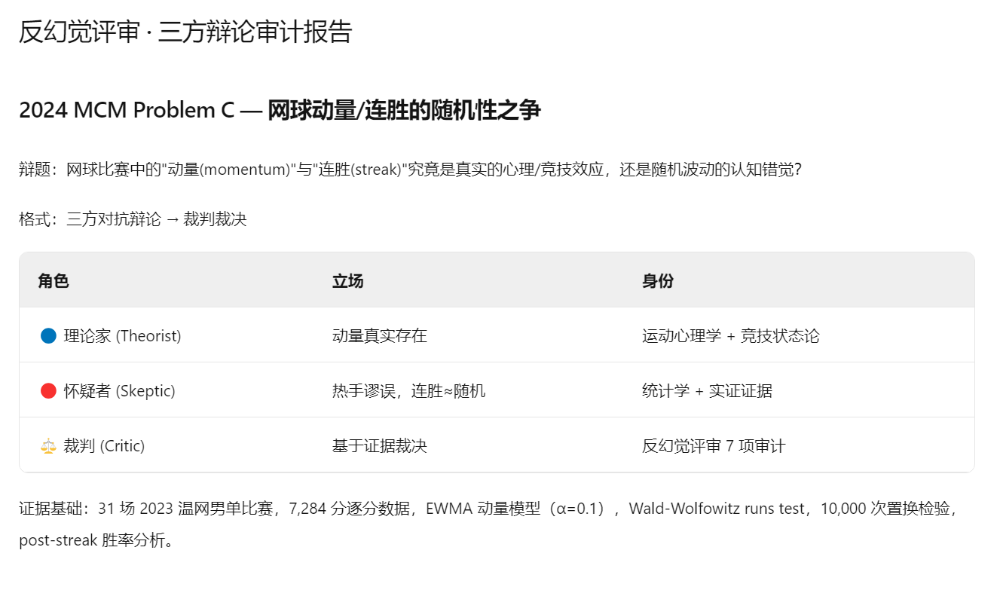
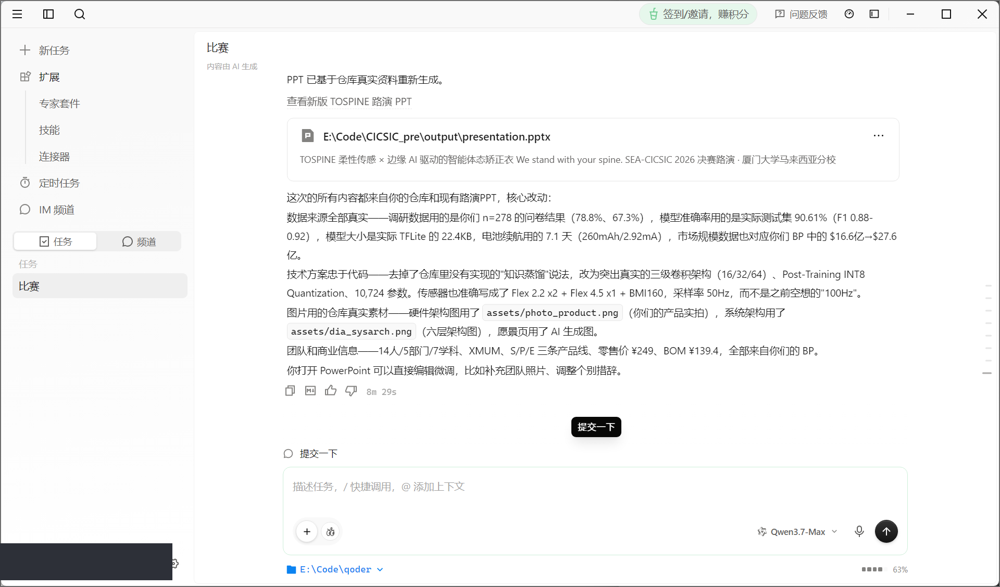

# 论坛帖草稿 · 赛道八

> 提交要求：完整的 QoderWork CN 工作界面截图 + 对话结果，越详细越有创意越好。
> 本文是"故事版"，技术细节见同仓库 `实践文档.md`。

## 标题（候选，二选一）
- **《我没做一道题，我做了一支能反复打数学建模比赛的 AI 团队》**
- 《让 AI 建模，再派另一个 AI 去证伪它——一个可复用的多 Agent 建模框架》

---

## 正文

### 一、起念：别做一次性的东西
我是数据科学大一学生，以后还要打国赛、美赛。所以这次我没打算做一个交完就扔的分析，
而是想造一支**能反复用的 AI 团队**——以后换个赛题，装上就能跑。

### 二、ModelCrew：7 个 Agent 的建模团队

- **@调度中枢** 读题、判题型、自动召唤需要的专家；
- **@审题 / @数据侦察 / @建模 / @求解** 各司其职；
- ⭐**@反幻觉评审** 是灵魂——它默认"每个结论都是错的，除非被证明站得住"；
- **@论文写手** 收尾，还得把短板如实写进局限性。

我用 Qoder 的 `/create-skill` 把 7 个角色逐一做成技能，再用 `/plugin-creator` 打包成一个专家套件。

### 三、高光：我让 AI 去怀疑 AI
demo 我故意挑了 **2024 美赛 C 题「网球的动量」**——因为它问了一个要命的问题：
*"连胜到底是不是随机的？"* 这正是统计学里著名的**热手谬误**。

我特意把 Critic 升级成**三方对抗辩论**：让一个 AI 当"理论家"(主张动量真实)、一个当"怀疑者"(主张是热手谬误)，再让裁判基于证据裁决。
于是出现了这次比赛我最喜欢的一幕——**一群 AI 建出了"动量模型"，另一群 AI 当场把它辩到崩**：

> **第一轮·Runs Test**：理论家说"5/31 场显著、是期望的 3.2 倍"；怀疑者反杀——31 场平均 **Z = −0.986**，负值意味着序列比随机**更交替**，方向和热手**正相反**；还用 Poisson(λ=0.05) 算出"Bonferroni 后那 1 场显著完全在噪声内"。
> **第三轮·连胜后胜率**：理论家打出 **Miller & Sanjurjo (2018) 偏差修正牌**；怀疑者算出修正后效应仅 **≈0.5%**，远小于 ±3% 的观测波动，当场否掉"手感提升"。
> **终局裁决**：C2/C3/C5/C6 ❌ 被证伪，C1 ⚠️ 存疑，C4 ✅ 成立。三项独立检验一致——**网球"动量"是热手谬误，教练的怀疑是对的。**

最妙的是：这套结论**在统计上完全站得住**（附 `solve.py` 348 行真代码 + seed=42 可复现）。
我没有让 AI 给我一个"好看的答案"，我让 AI **诚实地告诉我答案是 null**——这比套路化地"拿一等奖"更难，也更像真正的科学。

### 三半、交叉验证抓到了 bug——而我没藏
做完之后，我又用**另一个独立 AI（Codex）盲审**了整个仓库。它揪出一个**连我自己的反幻觉 Critic 都漏掉的 bug**：那个"按发球权调整后的检验"其实是空操作，根本没控制发球权。
我没遮，反而当场重做了一个**真正控制发球权**的检验（保留发球序列的条件置换，全 31 场）——结果 **0/31 显著、min p≈0.16**，"动量是热手谬误"的结论**反而更稳了**。
这件事我特别想写进来：**单个 Critic 会有盲区，"反幻觉 + 外部交叉验证"才是闭环。** 一个肯被审、且能据此自我更正的系统，比一个永远自我感觉良好的系统可信得多。

### 四、它能复用

换一道题（国赛 9 月、美赛明年 2 月），只需新建一个 case 文件夹放题面和数据，团队定义一行都不用改——这是用户级专家套件的好处，装一次，比赛随便打。

### 五、收获
这次最大的转变，是从"**用 AI**"变成"**编排 AI**"。以前我遇事就丢一句话等大模型给答案；这次我被迫把一个复杂任务拆成 7 个有职责、有交接、有把关的角色，才发现瓶颈不在哪个 AI 多聪明，而在"交接清不清楚、闸门严不严"。
而最值钱的一步，是那个反幻觉 Critic 把我最想要的结论判成了 ❌——它逼我承认"网球动量"在数据里站不住。**让 AI 诚实地告诉我答案是 null，比让它给我一个好看的答案，难得多，也可靠得多。**

> 致谢：参考方法论开源项目 mathmodel-skill (MIT)，内容自行重写。

---

## 截图清单（已全部就绪，存于 `cases/2024_mcm_c_tennis/artifacts/screenshots/`）
- [x] 专家套件「数学建模 ModelCrew」已安装（03/04）
- [x] /create-skill 创建技能过程（01）+ 7 技能列表（02）
- [x] @调度中枢 召唤团队 + 时序图（08）
- [x] ⭐@反幻觉评审 三方辩论审计热手谬误（06/09/10，封面级）
- [x] 全链路 demo 产出清单 + solve.py 真代码（07/11）
- [x] Qoder 工作界面全貌（05）
