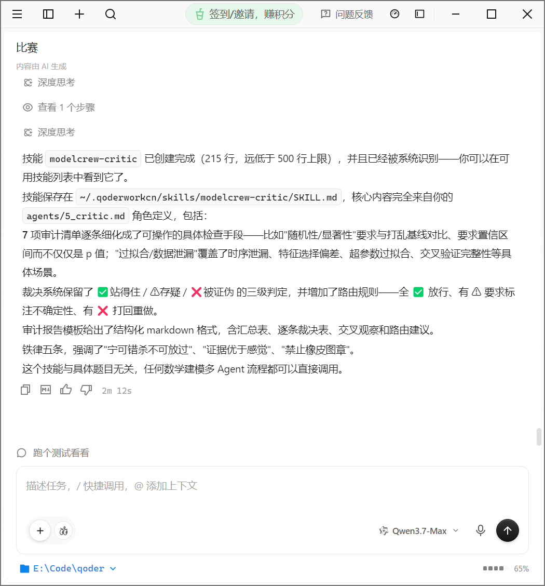
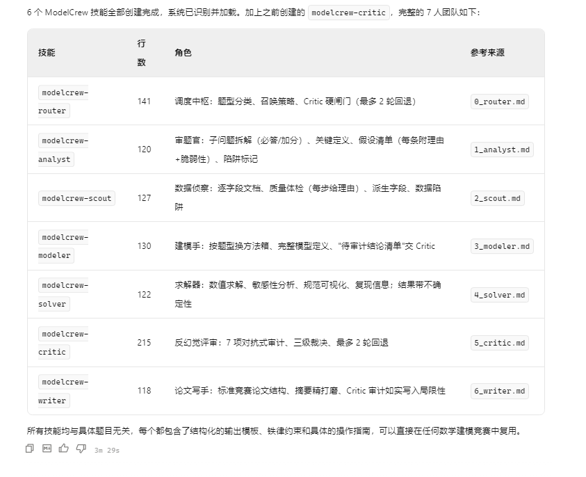
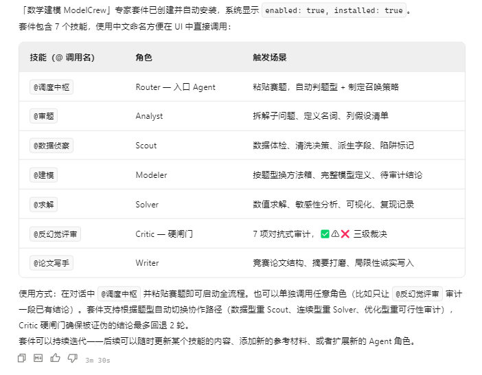
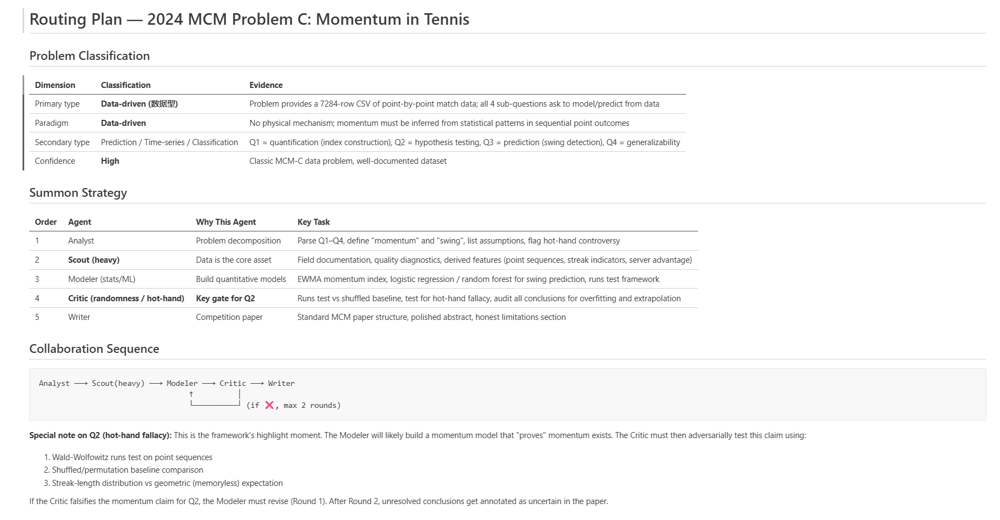
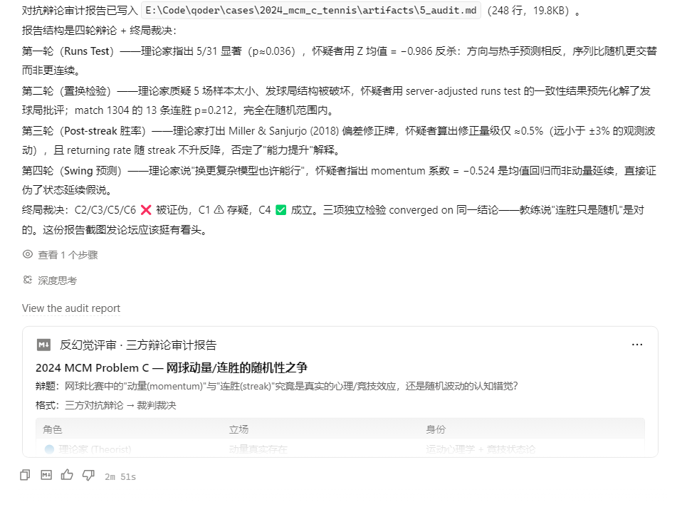
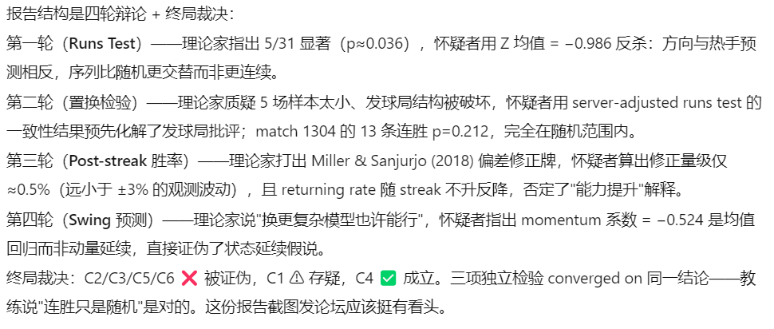
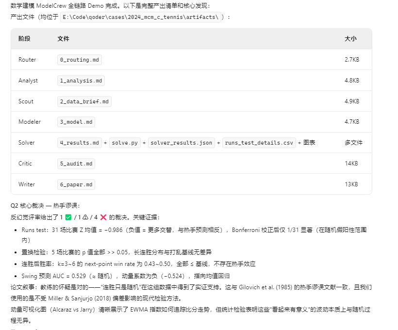
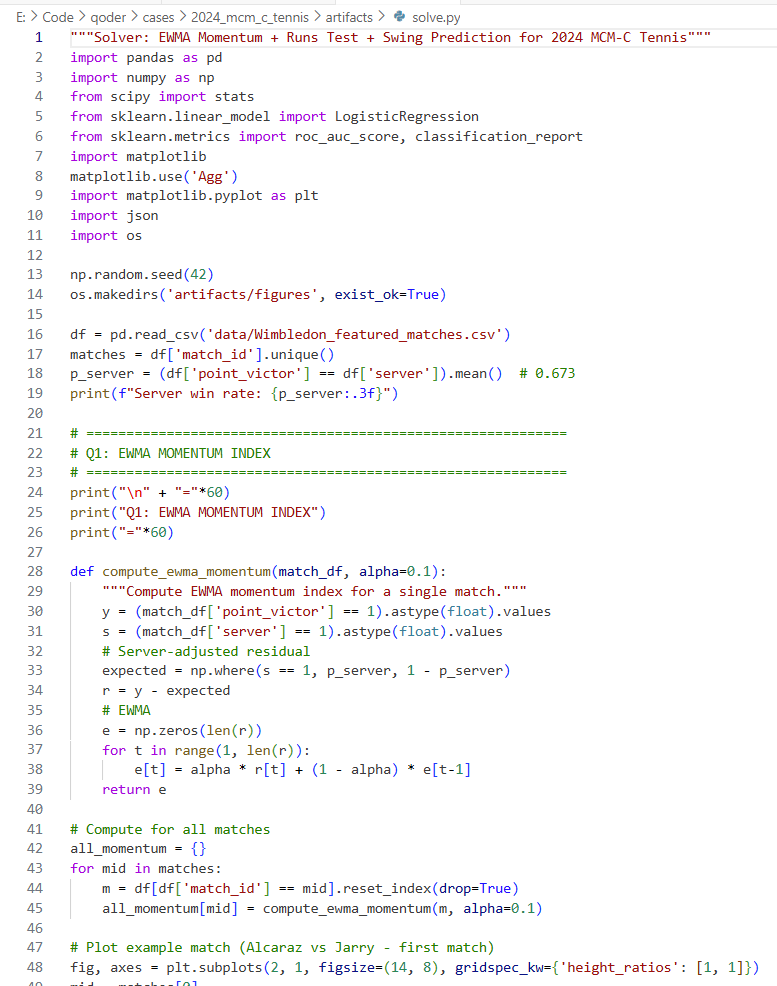

# 数学建模 ModelCrew —— 我用 Qoder 造了一支能反复打数学建模比赛的 AI 团队

> QoderWork CN 大赛 · 赛道八「多 Agent 编排挑战」· 个人参赛
> 作者：Andy（厦门大学马来西亚校区 · 数据科学与大数据技术）
> 日期：2026-06-13

---

## 1. 动机：我不想做一道题，我想造一个工具

我是数据科学大一学生，以后还要打国赛(CUMCM)、美赛(MCM/ICM)。
与其在这次比赛里做一个一次性的分析，我决定**造一支可复用的多 Agent 数学建模团队**——
以后换个赛题装上就能用。这才是赛道八「多 Agent 编排」真正想考的东西：**系统，而不是某道题**。

## 2. ModelCrew 是什么

一支 7 角色的 AI 团队，由调度中枢读题、自动召唤对应专家、Critic 反幻觉把关：

| 调用名 | 角色 | 职责 |
|---|---|---|
| @调度中枢 | Router | 读懂任意赛题 → 判题型 → 召唤专家 → 编排 + Critic 闸门 |
| @审题 | Analyst | 拆子问题、定义、假设、陷阱 |
| @数据侦察 | Scout | 数据体检、清洗留痕、派生字段、数据陷阱 |
| @建模 | Modeler | 按题型选方法、建模、列待审计结论 |
| @求解 | Solver | 求解 + 敏感性分析 + 可视化 + 复现 |
| ⭐@反幻觉评审 | Critic | 对抗式审计：随机性/因果/过拟合/外推，三级裁决 |
| @论文写手 | Writer | 按竞赛口味写论文，把局限性如实写入 |

它们被打包成一个 **Qoder 专家套件「数学建模 ModelCrew」**（用户级，跨项目可复用）。

**三层 Qoder 机制**：技能(Skill)=一个 Agent；专家套件(Suite)=一支团队；子代理=并发。

## 3. 怎么造出来的

1. 用 `/create-skill` 把 7 个角色逐一做成 `modelcrew-*` 技能（每个 ~2 分钟）。

   
   
2. 用 `/plugin-creator` 把 7 个技能打包成专家套件「数学建模 ModelCrew」。

   

## 4. 借鉴与原创（致谢）

`references/` 下 6 份资产（模型目录 / 反模式 / 评分维度 / **四层反馈** / 写作模板 / 相关工作）
方法论上参考了开源项目 [mathmodel-skill](https://github.com/handsomeZR-netizen/mathmodel-skill)（MIT），
**内容全部由我自己重写**，未搬运其原创数据。其中"四层反馈(L1 即时闸门→L2 跨阶段一致性→L3 终局多视角→L4 校准)"
让我的团队从"顺流水线"升级成"会自我纠错的工程系统"。

### 4.1 相关工作对标（我做了调研，设计方向经验证）
我调研了学术界/开源界的主流多 Agent 建模系统（详见 `references/related_work.md`），
发现 ModelCrew 的"角色分工 + Critic 闸门 + 多层反馈"与它们不谋而合，并吸收了它们的先进经验：

| 来源 | 我吸收的经验 | 落地到 |
|---|---|---|
| **MM-Agent**（NeurIPS 2025，助队伍获 MCM/ICM 2025 Finalist Award，top 2.0%） | Actor-Critic 选型 / 分层可检索模型库 / 迭代求解 | modeler、solver、model_catalog |
| **ModelingAgent**（arXiv 2505.15068） | 数据搜索能力 / 多专家视角评审 | scout、critic(L3 panel) |
| **Sci-Mind**（arXiv 2603.27584） | **对抗辩论**(原文 Theorist vs Pragmatist；我适配为理论家 vs 怀疑者) / 自验证断言 | critic(辩论模式)、solver(assertions) |

**我的原创差异**：① 原生用 Qoder Skill+专家套件实现，可一键安装、跨比赛复用；
② 以反幻觉 Critic 为团队核心并升级为对抗辩论；③ 题目无关、换题即插即用。

## 5. Demo：2024 MCM Problem C「网球的动量」

为什么选它：题目 Q2 本身就问"连胜到底是不是随机的"——这正是统计学经典争议
**热手谬误(hot-hand fallacy)**，是我的 Critic Agent 的完美舞台。

数据：2023 温网男单逐分数据（31 场，约 7284 分）。

### 运行过程（全链路真跑通，产出 7 份工件 + 真实 Python 代码）
- **@调度中枢**：判定为数据型(C 题)，召唤路径 审题→数据侦察→建模→求解→Critic→写手 → `0_routing.md`
- **@数据侦察 / @建模 / @求解**：Solver 真跑 `solve.py`(348 行)，读真实数据算出
  服务方胜率 0.673、逐场 runs test、置换检验(10000 次)、Swing 逻辑回归 → `solver_results.json`、`runs_test_details.csv`、`figures/`
- ⭐**@反幻觉评审（高光）**：对 6 条结论(C1–C6)逐条对抗式审计，**裁决 1✅ / 1⚠️ / 4❌**：
  - **C2「动量真实存在」→ ❌ 证伪**（核心 Q2）：runs test 31 场 mean Z = **−0.986**（负值=更多交替，与热手**相反**），Bonferroni 校正后仅 1/31 显著(在假阳性范围内)；**真正控制发球权的条件置换（全 31 场）0/31 显著**(min p≈0.16，详见 §6.5 更正)；连胜后下一分胜率 0.43–0.50，**全部 ≤ 基线**，无热手效应
  - **C5「Swing 预测 AUC>0.65」→ ❌ 证伪**：实测 AUC = **0.529**(≈随机)，动量系数 **−0.524**(负)=指向均值回归
  - **C4「控制发球后无热手」→ ✅ 成立**；C1「EWMA 可视化」→ ⚠️(α=0.1 未做敏感性、发球调整用全局率偏粗)
- **@论文写手**：把 Critic 结论如实写进局限性，结论是"数据**不支持**非随机动量"，与 Gilovich et al.(1985) 热手谬误文献一致，并说明用了不受 Miller & Sanjurjo(2018) 偏差影响的现代检验 → `6_paper.md`

**关键截图**：

### 关键结果
- **Q1 动量量化**：服务方调整残差的 EWMA 指标(α=0.1)，能可视化 Alcaraz vs Jarry 的比分走势
- **Q2 是否随机**：⭐**动量是热手谬误**——三个独立统计检验一致表明，控制发球优势后逐分序列与随机不可区分；教练"连胜只是随机"的怀疑被实证支持
- **Q3 反转预测**：AUC 0.529 几乎等于随机，动量系数为负，更像均值回归而非"势头延续"

## 6. 可复用性

换一道题（如国赛 C 题），只需新建 `cases/<新题>/` 放题面和数据，
再对 @调度中枢 说一句"按新题路由"，团队定义一行不用改。

## 6.5 交叉验证与自我更正（作品最诚实的一笔）

作品做完后，我用另一个独立 AI（Codex）对整个仓库做盲审交叉验证。它抓到一个**连我自己的反幻觉 Critic 都漏掉的 bug**：`solve.py` 里的"server-adjusted runs test"其实是**空操作**（二值化后等于原始序列），并没有真正控制发球权——所以"raw 与 adjusted 一致 ⟹ 发球权已控制"的解释是错的。

我没有掩盖，而是把它当成一次真实的工程修正：
- 本地确认 bug（`r_binary == y`，diffs=0）；
- 重做**真正控制发球权**的检验（条件置换保留发球序列，全 31 场）：**0/31 显著、min p≈0.16**；连胜后胜率按发球/接发分层后仍贴合基线；
- 结论不仅成立，**反而更稳**——证据落盘在 `serveaware_results.json`，全过程见 `cases/2024_mcm_c_tennis/artifacts/CORRECTION_serveaware.md`。

这件事恰好印证了我的设计理念：**单个 Critic 会有盲区，所以"反幻觉 + 外部交叉验证"才是可靠 AI 工程的闭环。** 一个会被外部审计、且能据此自我更正的系统，比一个永远"自我感觉良好"的系统可信得多。

## 7. 收获与反思

- **从"用 AI"到"编排 AI"**：以前我把大模型当一个全能助手，遇事丢一句话等答案。这次我被迫把一个复杂任务拆成 7 个有明确职责、明确交接、明确把关的角色——这才发现"编排"本身是一门工程，瓶颈不在某个 Agent 多聪明，而在交接清不清楚、闸门严不严。
- **"让 AI 怀疑 AI"比"让 AI 给答案"更难、也更值钱**：最有价值的一步不是建出动量模型，而是那个反幻觉 Critic——它把"动量真实存在"这个最诱人的结论判成了 ❌。如果没有它，我大概会高高兴兴地把一个错误结论写进论文。一个会自我证伪的系统，比一个只会给漂亮答案的系统可靠得多。
- **诚实是可以工程化的**：通过 Critic 闸门 + 反模式清单 + 断言自检，我把"不编数据、不过度解读"从一句口号变成了流程里强制执行的环节。
- **它对我是真工具**：国赛 9 月、美赛明年 2 月，这套 ModelCrew 我装上就能接着用——这次比赛的产出不是一次性的，而是一个会一直陪我打比赛的副驾。

---
### 附录：仓库结构
`agents/`(角色源稿) · `skills/`(7 技能备份) · `references/`(6 借鉴资产) · `cases/2024_mcm_c_tennis/`(demo，含 v1 单审 + v2 辩论两版审计、solve.py、截图) · `submission/`(本文档 + 论坛帖)
